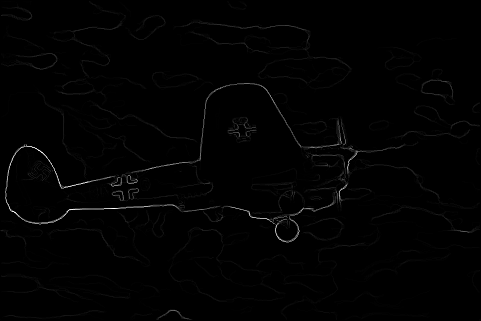
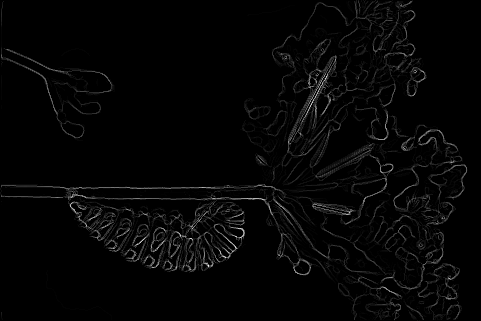
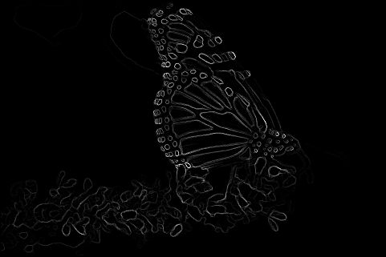
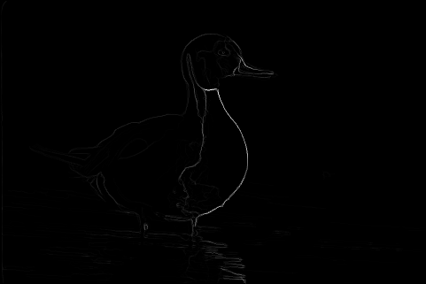
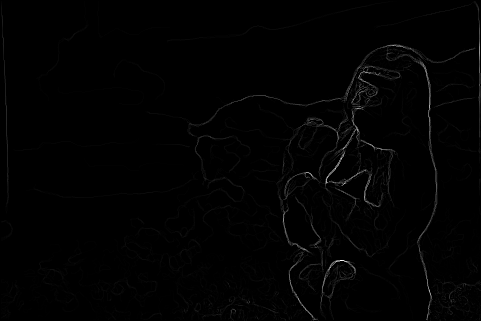
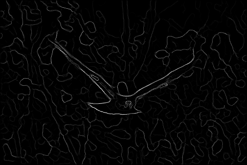
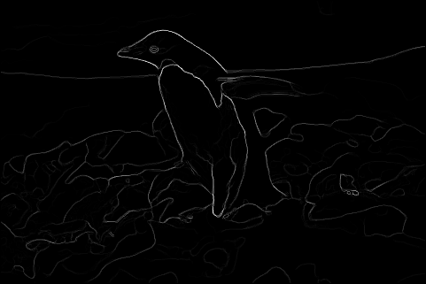
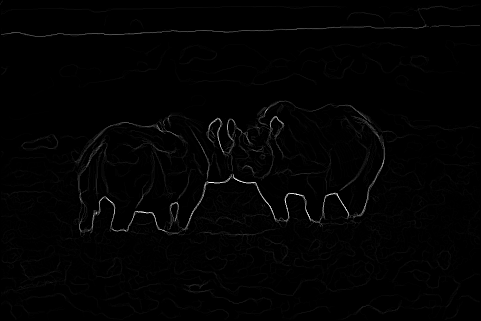
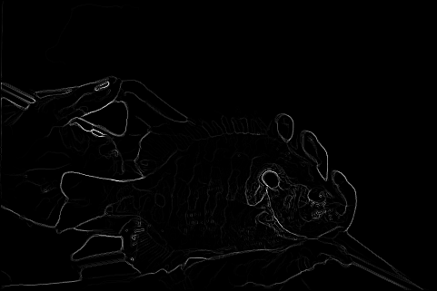
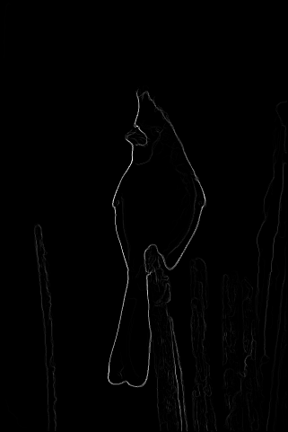

# PB-Lite Algorithm for Edge Detection & Deep Learning Approaches for Image Clasification


## Overview

The **PB-Lite (Probability of Boundary - Lite)** algorithm is an efficient edge detection framework inspired by advanced contour detection techniques. This framework is a simplified version of a recent paper '[Contour Detection and Hierarchical Image Segmentation](https://www2.eecs.berkeley.edu/Research/Projects/CS/vision/grouping/papers/amfm_pami2010.pdf)'. It combines multiple gradient-based and clustering methods to generate accurate edge-detection outputs for images. This simplified version finds boundaries by examining brightness, color, and texture information across multiple scales (different sizes of objects/image). The output of this edge detection framework is a per-pixel probability of boundary. 

We also explore multiple **Deep learning(DL)** architectures--**ResNet, ResNeXt, DenseNet** and a **Custom neural network** to enhance image classification performance. The goal is to evaluate and compare their performance in terms of accuracy, efficiency, and scalability. The project leverages **TensorFlow v1** for training and testing the models, using a custom dataset for classification.

## Features

1. **Pb-lite Edge Detection:**
    - **Filter Banks**: Create three sets of filter banks for filtering images. (Leung-Malik (LM), Difference of Gaussian (DoG), and Gabor filter banks.)
    - **Edge Detection**: Combines multiple gradient responses from texture, brightness and color to compute probability of edges with baseline edge-detection methods (Canny, Sobel).
    - **Modular Design**: Allows flexibility for experimentation and fine-tuning.

2. **Imge Classification:**
    - **Deep Learning(DL) models**: training and testing CNN, custom CNN(CNN_BN), ResNet, ResNext and Densenet for image classification.
    - **TensorFlow v1 Compatibility**: Uses TensorFlow v1 for model training, ensuring backward compatibility.
    - **Modular Design**: Each model implementation is modular and can be trained/tested independently.
    - **Performance Metrics**: Tracks training accuracy, testing accuracy, and loss.
    - **Fine-Tuning Support**: Easily fine-tune the models for better performance.

## Methodology

### Pb-lite Edge Detection

1. **Filter Bank Generation**:
    Generating filter banks for building low level features to measure texture properties and to aggregate regional texture and brightness distributions. 
   - Leung-Malik filters for textural information.
   - Difference of Gaussian filters for multi-scale edge detection.
   - Gabor filters for orientation-specific features.

3. **Map Creation**:
   - Texture maps using filter bank responses and K-means clustering.
   - Brightness and color maps using clustering on pixel intensities.

4. **Gradient Computation**:
   - Chi-square gradients using half-disc masks to highlight edges.

5. **Edge Detection**:
   - Combine texture, brightness, and color gradients with Sobel and Canny baselines To generate PB-Lite edge-detected outputs using probabilistic methods.

Read More in detail here: [CMSC-733, Homework0:Alohomora](https://cmsc733.github.io/2022/hw/hw0/#starter)

### Deep Learning techniques for Image Classification 

1. **CNN**: This serves as a foundational model to establish image classification performance. 
2. **CNN-BN**: Designing a custom architecture to improve convergence and explores advanced techniques to demonstrate performance improvements.
3. **ResNet**: Implementing residual connections to enable training deeper networks by mitigating vanishing gradient problem in deeper networks.
4. **ResNeXt**: highlights the impact of grouped convolutions and cardinality on model performance, providing a modern alternative to traditional ResNet architectures.
5. **DenseNet**: demonstrates the effectiveness of feature reuse and compact architectures, It connects each layer to every other layer in a feed-forward fashion and utiliozes dense connections, reducing number of parameters.

- **Data Preparation**: Images and corresponding classifications are split into train and test sets.
- **Data Augmentation**: Different augmentation techniques such as rotation, translation, etc are performed to enhance the model's robustness.
- **Model Implementation**: Different models are trained using custom architectures to monitor training and testing accuracy(i.e `loss over epochs`) .
- **Evaluation**: Comparing results across all architectures. Generating visualizations(`loss over epochs`) for training/validation accuracy and loss.

## Installation

### Pb-lite Edge Detection

### Prerequisites

Ensure you have Python 3.8 or later installed. Install additional dependencies listed in the `requirements.txt` file.

### Setup Instructions

1. **Clone this repository**:
   ```bash
   git clone https://github.com/StarkGoku10/Pb_lite_Edgedetection.git
   cd pb_lite_edgedetection
   ```

2. **Create a Virtual Environment(Optional but recommended)**
    ```bash 
    python3 -m venv venv
    source venv/bin/activate #on windows: venv\Scripts\activate
    ```

2. **Install dependencies**:
   ```bash
   pip install -r requirements.txt
   ```

3. **Set up the folder structure for results**:

    Navigate to Classical_Edge_Detection folder and run the following script for folder structure for storing results:
   ```bash
   python folders.py
   ```

4. **Dataset**:
    - This project is tested on BSDS500 Dataset, you can download and keep your dataset in the `Datasets/` directory.

**Note** :All the paths to store the intermediate and final results are appropriately directed to the correct directory.

### Running the Code

1. **Navigate to Classical_Edge_Detection Directory**:
    ```bash 
    cd Classical_Edge_Detection
    ```

2. **Run Pb_lite** script to process all 10 images in the dataset and generate outputs:
    ```bash
    python pb_lite.py
    ```

    Optional argument:
    - `--Maps_flag`: If set to `False`, precomputed maps will be loaded instead of generating new ones.

    Example:
    ```bash
    python pb_lite.py --Maps_flag=False
    ```

    - **Input**: The script will load and process images stored in `Datasets/BSDS500/Images` directory.

    - **Outputs**:

        - Filter banks visualizations: Saved in `results/filterbanks/`.
        - Maps (texture, brightness, color): Saved in `results/maps/`.
        - Gradients and final edge-detected images: Saved in `results/edges/imgX/` (where `X` is the image number).

### Deep Learning Approaches:

### Prerequisites

- **Python 3.7** or later.
- **TensorFlow v1.x**: Ensure TensorFlow v1.x is installed for compatibility with the codebase.
- **GPU Support (Optional but recommended)**: Install CUDA and cuDNN for faster training.
- **Dataset**: CIFAR-10 dataset, properly structured in `Datasets/CIFAR10/Train/` and `Datasets/CIFAR10/Test/`.
- Install additional dependencies listed in the `requirements.txt` file:
       ```bash
        pip install -r requirements.txt
       ```

### Running the Code
1. **Navigate to Deep_learning_Architectures Directory**:
    ```bash 
    cd Deep_learning_Architectures
    ```

2. **Training models**:
    - Run `Train.py` script to train a model:
        ```bash
        python train.py --BasePath Datasets/CIFAR10/Train \
                    --CheckPointPath Checkpoints/DenseNet/ \
                    --NumEpochs 10 \
                    --MiniBatchSize 64
        ```
        **Note**: The default model is DenseNet. To change the model, navigate to `Network/`, select your model of choice and import it to the `train.py` file.

        Optional arguments:
        - `--DivTrain`: Factor to reduce training data for faster epochs (default: `1`).
        - `--LogsPath`: Path to save TensorBoard logs (default: `Deep_learning_architectures/Logs/DenseNet/`).
        - `--LoadCheckPoint`: Set to 1 to resume training from the latest checkpoint, otherwise set to 0.

            Example to load from the latest checkpoint:
            ```bash
            python train.py --BasePath Datasets/CIFAR10/Train \
                    --CheckPointPath Checkpoints/DenseNet/ \
                    --NumEpochs 10 \
                    --MiniBatchSize 64 \
                    --LoadCheckPoint 1
            ```

3. **Monitor Training Proress**:
    - **Tensorboard**: Launch TensorBoard to visualize training metrics:
        ```bash
        tensorboard --logdir=Deep_learning_architectures/Logs/DenseNet/
        ```
    - Open a browser and navigate to `http://localhost:6006/`.

4. **Evaluating the model**:
    - Ensure the trained model checkpoints are saved in the specified directory:
        `Deep_learning_architectures/Checkpoints/<ModelName>/`
        Replace `<ModelName>` with the name of the model (e.g., `DenseNet`).
    - Ground truth labels for the test set should be saved in:
       `Deep_learning_Architectures/TxtFiles/LabelsTest.txt`
    - Run Inference: 
        ```bash
        python test.py --BasePath Datasets/CIFAR10/Test/ \
               --ModelPath Deep_learning_architectures/Checkpoints/DenseNet/ \
               --LabelsPath Deep_learning_Architectures/TxtFiles/LabelsTest.txt
        ```
        **Note**: The default model is DenseNet. To change the model, navigate to `Network/`, select your model of choice and import it to the `test.py` file.

        Optional arguements:
        - `--NumEpochs`: Number of epochs to evaluate (default: 3).
        - `--ModelPath`: Path to the directory containing the model checkpoints.
        - `--BasePath`: Path to the directory containing the test images.
        - `--LabelsPath`: Path to the file containing ground truth labels for the test set.

            Example to test the model after 5 epochs:
            ```bash
            python test.py --BasePath Datasets/CIFAR10/Test/ \
               --ModelPath Deep_learning_architectures/Checkpoints/DenseNet/ \
               --LabelsPath Deep_learning_Architectures/TxtFiles/LabelsTest.txt \
               --NumEpochs 5
            ```

5. **Results**:
    - Training results are stored in `Results/<model name>/train/` Directory. It includes `training loss and accuracy over epochs`.
    - Testing results are stored in ``Results/<model name>/test/` Directory. It includes `testing accuracy over epochs` and `confusion matrix`.
    - Predicted labels are saved in `Deep_learning_Architectures/TxtFiles/PredOut.txt` file.

    **Note**: Ensure the paths for reading the respective images, labels, checkpoints are directed according to directory structure.


## Results

### Pb-lite Edge Detection Results:

<table>
  <tr>
    <td></td>
    <td></td>
    <td></td>
  </tr>
  <tr>
    <td></td>
    <td></td>
    <td></td>
  </tr>
  <tr>
    <td></td>
    <td></td>
    <td></td>
  </tr>
  <tr>
    <td colspan="3"></td>
  </tr>
</table>


## Fine-Tuning for Better Performance

1. **Adjust Filter Parameters**:
   - Modify kernel sizes, orientations, and scales for LM, DoG, and Gabor filters in the script.

2. **Clustering Optimization**:
   - Experiment with different values of `num_clusters` in texture, brightness, and color map generation.

3. **Gradient Weights**:
   - Adjust the weights `alpha`, `beta`, and `gamma` in the edge combination step for optimal blending.

4. **Dataset**:
   - Test the algorithm on additional datasets to generalize performance.

5. **Baseline Blending**:
   - Experiment with different combinations of Sobel and Canny baselines.

---

For more details or to contribute, please contact [your-email@example.com].

